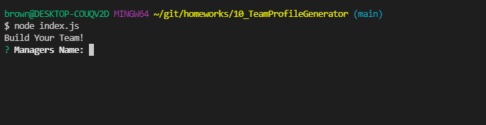
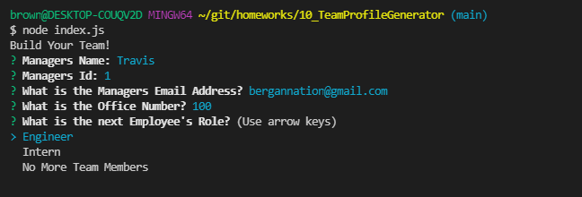
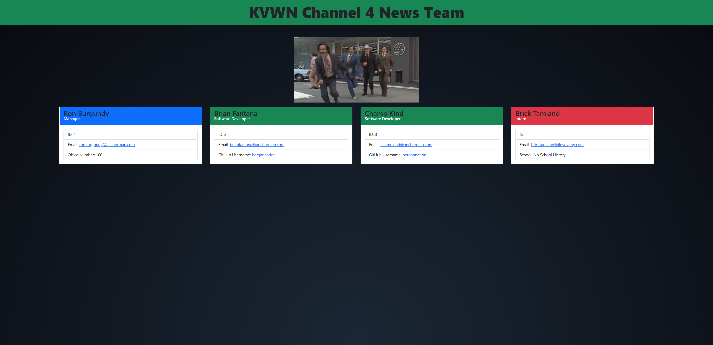

# 10 Object-Oriented Programming: Team Profile Generator

## Your Task

Your task is to build a Node.js command-line application that takes in information about employees on a software engineering team, then generates an HTML webpage that displays summaries for each person. Testing is key to making code maintainable, so you’ll also write a unit test for every part of your code and ensure that it passes each test.

Because this application won’t be deployed, you’ll need to provide a link to a walkthrough video that demonstrates its functionality and all of the tests passing. You’ll need to submit a link to the video AND add it to the readme of your project.

> **Note**: There is no starter code for this assignment.

## User Story

```md
AS A manager
I WANT to generate a webpage that displays my team's basic info
SO THAT I have quick access to their emails and GitHub profiles
```

## Acceptance Criteria

```md
GIVEN a command-line application that accepts user input
WHEN I am prompted for my team members and their information
THEN an HTML file is generated that displays a nicely formatted team roster based on user input
WHEN I click on an email address in the HTML
THEN my default email program opens and populates the TO field of the email with the address
WHEN I click on the GitHub username
THEN that GitHub profile opens in a new tab
WHEN I start the application
THEN I am prompted to enter the team manager’s name, employee ID, email address, and office number
WHEN I enter the team manager’s name, employee ID, email address, and office number
THEN I am presented with a menu with the option to add an engineer or an intern or to finish building my team
WHEN I select the engineer option
THEN I am prompted to enter the engineer’s name, ID, email, and GitHub username, and I am taken back to the menu
WHEN I select the intern option
THEN I am prompted to enter the intern’s name, ID, email, and school, and I am taken back to the menu
WHEN I decide to finish building my team
THEN I exit the application, and the HTML is generated
```

## Table of Contents

If your README is long, add a table of contents to make it easy for users to find what they need.

- [Links to Application](#Links)
- [Mock-Up](#Mock-Up)
- [Install](#installation)
- [Usage](#usage)
- [Credits](#credits)
- [Test](#test)
- [Questions](#questions)

## Links

Below are links to access this live website and repository.

Github: https://github.com/bergannation/10_TeamProfileGenerator

Deployed Video Link: https://drive.google.com/file/d/13vd7-kNTCwLh0pJ38bp2BhJeZuzZuy7k/view

## Mock-Up

The following gif shows the web application's appearance and functionality:


## Installation

The user will be required to use the Inquirer package via NodeJS & NPM commands. The user will input the following in their command line to install the neccessary packages:

```bash
npm i
```

## Usage

The user will begin the process by invoking the application in NodeJS. The application will be invoked by using the following command:

```bash
node index.js
```






Once the user has inputted the information he wishes to have for each question, the HTML is generated in the "Dist" folder within the directory. Each employee's input is then rendered into cards for reference.



## Tests

Testing: run "npm run test" in your command line for testing. You will see functionality of the testing in the gif below. This application used four different tests to check for errors.

[Jest](https://www.npmjs.com/package/jest) was used for unit testing.


## Questions

Here is a link to my github for more information: [Github]: https://github.com/BerganNation

You can reach me with any additional questions by email: BerganNation@gmail.com
